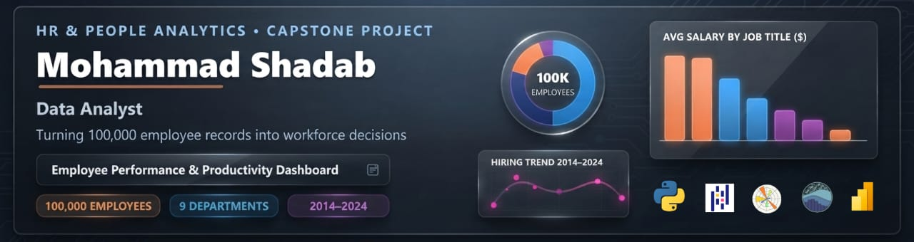
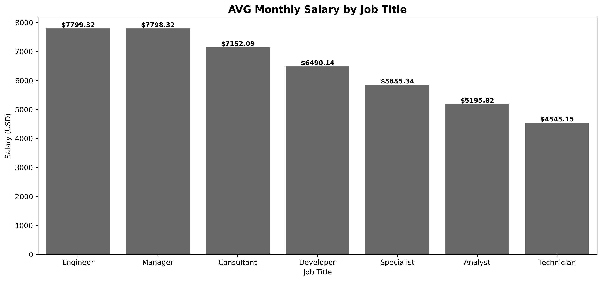
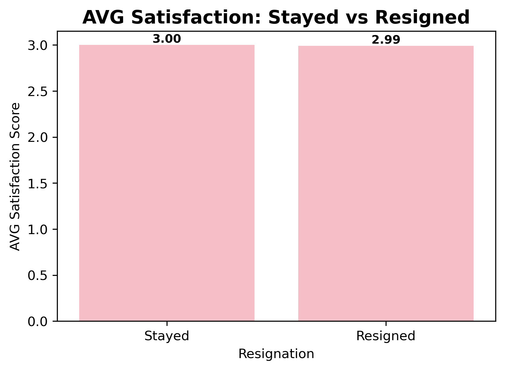

<div align="center">



# Employee Performance & Productivity Analytics

### 📊 100,000 Employees · 9 Departments · 2014–2024

*What a decade of employee records reveals about pay, performance, attrition — and the HR myths the data dismantles.*

[](https://github.com/Mohammadshadab1/employee-performance-analysis/tree/main/Notebook)
[](https://github.com/Mohammadshadab1/employee-performance-analysis/tree/main/Power%20BI%20pbix)
[](https://github.com/Mohammadshadab1/employee-performance-analysis/tree/main/Charts)
[](#-dataset)

</div>

---

## 📖 About

An end-to-end **HR & People Analytics** project on a **100,000-employee dataset** spanning **10 years (2014–2024)** across **9 departments**. It combines Python-based exploratory analysis, a **21-chart visualisation suite**, an interactive **4-tab Power BI dashboard**, and an **animated presentation**.

The analysis delivers a counter-intuitive story: **job title is the only real driver of pay, attrition is a flat ~10% everywhere, and satisfaction scores do not predict who leaves.**

> **Author:** Mohammad Shadab — Data Analyst · Python · SQL · Power BI · Excel

---

## 🎯 Headline Findings

| # | Finding | Evidence |
|---|---------|----------|
| 1️⃣ | **Job title is the only real pay lever** | Engineers/Managers ≈ **$7,799** vs Technicians **$4,545** → **72% gap** |
| 2️⃣ | **Education barely affects pay** | PhD $6,431 vs Bachelor $6,398 → just **0.52%** (~$1/day) |
| 3️⃣ | **Gender pay equity is achieved** | $6,400–$6,415 across groups → **~0.2% gap** (a win to protect) |
| 4️⃣ | **Tenure is not rewarded** | Year 0 earns $6,402; Year 10 earns **$6,348** (flat → down) |
| 5️⃣ | **Performance ratings are noise** | ~20,000 employees in *every* score bucket (1–5) |
| 6️⃣ | **Training doesn't move performance** | 49.28–49.70 training hours at every rating (25-min range) |
| 7️⃣ | **Satisfaction doesn't predict attrition** | Stayed **3.00** vs Resigned **2.99** — no signal |
| 8️⃣ | **Attrition is a flat 10.01% everywhere** | Department, education & remote work all within ~1 point |
| 9️⃣ | **Only meaningful correlation** | Performance ↔ Salary **r = 0.51** — all others ≈ 0.00 |
| 🔟 | **2024 shock** | Hiring dropped **31%** (10.0K → 6.9K) |

---

## 📊 Interactive Power BI Dashboard

Four tabs covering the full workforce story:

<table>
  <tr>
    <td align="center"><b>1 · Overview</b><br>Headcount, hiring trend, demographics</td>
    <td align="center"><b>2 · Compensation</b><br>Pay across role, education & gender</td>
  </tr>
  <tr>
    <td></td>
    <td></td>
  </tr>
  <tr>
    <td align="center"><b>3 · Performance</b><br>Ratings, training, tenure</td>
    <td align="center"><b>4 · Attrition & Satisfaction</b><br>Turnover drivers & the satisfaction paradox</td>
  </tr>
  <tr>
    <td></td>
    <td></td>
  </tr>
</table>

📁 Open the live dashboard: **[`Power BI pbix/Employee Performance & Productivity Dashboard.pbix`](https://github.com/Mohammadshadab1/employee-performance-analysis/blob/main/Power%20BI%20pbix/Employee%20Performance%20%26%20Productivity%20Dashboard.pbix)** in Power BI Desktop.

---

## 📂 Repository Structure

```
employee-performance-analysis/
│
├── Banner/                  # Project banner
│   └── banner.jpeg
│
├── Charts/                  # 21 individual analysis charts (PNG)
│
├── Notebook/                # Full analysis — Jupyter notebook + PDF export
│   ├── Employee Performance & Productivity.ipynb
│   └── Employee Performance & Productivity.pdf
│
├── Powe BI Dashboard/       # 4 dashboard tab screenshots + dashboard PDF
│   ├── 1. Overview.png
│   ├── 2. Compensation.png
│   ├── 3. Performance.png
│   └── 4. Attrition & Satisfaction.png
│
├── Power BI pbix/           # Interactive Power BI dashboard (.pbix)
│   └── Employee Performance & Productivity Dashboard.pbix
│
├── Presentation/            # Slide deck — animated PPTX + PDF
│   ├── Employee Performance Presentation.pptx
│   └── Employee Performance Presentation.pdf
│
└── Dataset.zip              # Source dataset — 100,000 employee records
```

---

## 📈 Key Visualizations

A few of the **21 charts** in [`Charts/`](https://github.com/Mohammadshadab1/employee-performance-analysis/tree/main/Charts):

<table>
  <tr>
    <td align="center"><b>Average Salary by Job Title — the 72% gap</b></td>
    <td align="center"><b>Satisfaction: Stayed vs Resigned — 3.00 vs 2.99</b></td>
  </tr>
  <tr>
    <td></td>
    <td></td>
  </tr>
</table>

The full suite covers **workforce** (headcount, hiring trend 2014–2024, tenure), **compensation** (salary by department / education / job title / gender, experience vs salary), **performance** (score distribution, training hours, ratings by job & education), **attrition** (by department / education / remote frequency), and **correlation matrices**.

---

## 🧠 Methodology

1. **Data preparation** — cleaned & validated 100,000 records (categorical fields + numeric ranges)
2. **Descriptive analytics** — aggregates across department, education, gender, job title, tenure & age
3. **Attrition analysis** — resignation rates per segment incl. remote-work frequency curve
4. **Correlation analysis** — Pearson matrices across 6 & 15 numeric features (only Performance ↔ Salary survives: **r = 0.51**)
5. **Storytelling & visualisation** — 21 charts, interactive 4-tab Power BI dashboard, animated slide deck

### 🛠 Tools & Skills
`Python` · `pandas` · `NumPy` · `matplotlib` · `seaborn` · `Jupyter Notebook` · `Power BI` · `EDA` · `Correlation Analysis` · `Data Storytelling`

---

## 💡 Recommendations for Leadership

1. **Rebuild job levelling & publish salary bands** — the 72% title gap is the entire pay story
2. **Price tenure into compensation** — year-10 staff currently earn the least
3. **Rebuild the churn early-warning system** — satisfaction predicts nothing; add intent-to-stay signals + a leavers model
4. **Target training, don't ration it equally** — measure rating lift vs a control group
5. **Calibrate performance reviews** — uniform ratings drive pay (r = 0.51) yet carry no information
6. **Investigate the 2024 anomaly** — 31% hiring drop + peak hybrid attrition; start with Finance (10.54%)

---

## ▶️ How to Explore

| Want to… | Open |
|---|---|
| Interact with the dashboard | `Power BI pbix/…pbix` in **Power BI Desktop** |
| Read the analysis & code | `Notebook/Employee Performance & Productivity.ipynb` |
| Present the story | `Presentation/` — **PPTX** (auto-play animations) or **PDF** |
| View individual charts | [`Charts/`](https://github.com/Mohammadshadab1/employee-performance-analysis/tree/main/Charts) folder |
| Get the data | `Dataset.zip` |

---

<div align="center">

## 👤 Author & Contact Details

**Mohammad Shadab** — Data Analyst
*Python · SQL · Power BI · Excel · Data Storytelling*

Let's connect and discuss data analytics, business intelligence, and opportunities!

 📧 *Email:* [jrshadab921@gmail.com](mailto:jrshadab921@gmail.com)
💼 *LinkedIn:* [Mohammad Shadab](https://www.linkedin.com/in/mohammad-shadab-550aab24b)
 🐙 *GitHub:* [Mohammadshadab1](https://github.com/Mohammadshadab1)
 🌐 *Portfolio:* [Mohammad Shadab Portfolio](https://myportfoliowebsite-lyart.vercel.app/)
📊 *Presentation Deck:* [View Executive PDF Deck](./Presentation/Presentation.pdf)

**Mohammad Shadab** — Data Analyst
*Python · SQL · Power BI · Excel · Data Storytelling*

Feedback, questions and collaboration welcome — feel free to connect!

⭐ **If you find this project useful, please give it a star!** ⭐

</div>
